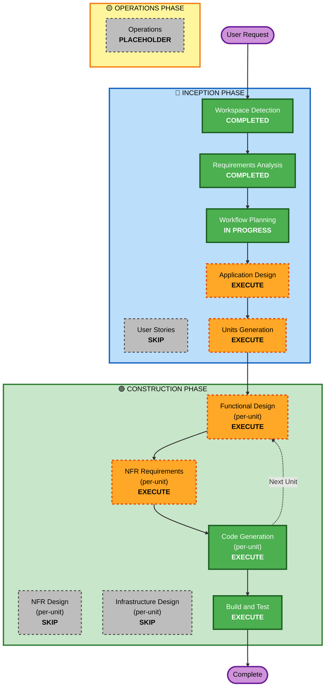

# LaunchPilot AI - Execution Plan

## Detailed Analysis Summary

### Project Type
**Greenfield** - New full stack web application with no existing codebase

### Change Impact Assessment
- **User-facing changes**: Yes - Complete user interface with homepage and dashboard
- **Structural changes**: Yes - New full stack architecture with React frontend, Express backend, MongoDB database
- **Data model changes**: Yes - New MongoDB schema for blueprint storage and session management
- **API changes**: Yes - New RESTful API endpoints for blueprint generation, storage, and retrieval
- **NFR impact**: Yes - Performance, usability, scalability, and deployment requirements

### Risk Assessment
- **Risk Level**: Low-Medium
- **Rollback Complexity**: Easy (greenfield project, no existing system to break)
- **Testing Complexity**: Moderate (full stack integration testing required)
- **Rationale**: Well-defined requirements, proven technology stack, clear scope

---

## Workflow Visualization

---

## Phases to Execute

### 🔵 INCEPTION PHASE

#### ✅ Completed Stages
- [x] **Workspace Detection** - COMPLETED
  - Confirmed greenfield project with no existing codebase
  
- [x] **Requirements Analysis** - COMPLETED
  - Comprehensive requirements documented with functional, non-functional, and technical specifications

#### 🚧 Current Stage
- [x] **Workflow Planning** - IN PROGRESS
  - Creating execution plan and determining stage sequence

#### 📋 Stages to Execute

- [ ] **Application Design** - EXECUTE
  - **Rationale**: New full stack application requires high-level component architecture
  - **Deliverables**:
    - Component identification (React components, Express routes, MongoDB models)
    - Service layer design (API service, database service, blueprint generation service)
    - Component interaction diagrams
    - Data flow architecture
  - **Why needed**: Multiple components across frontend, backend, and database need clear architectural definition

- [ ] **Units Generation** - EXECUTE
  - **Rationale**: Complex full stack system benefits from decomposition into parallel development units
  - **Deliverables**:
    - Unit breakdown (Frontend Unit, Backend API Unit, Database Unit, Integration Unit)
    - Unit dependencies and execution order
    - Unit-to-story mapping
  - **Why needed**: Enables structured development with clear boundaries and dependencies

#### ⏭️ Stages to Skip

- [ ] **User Stories** - SKIP
  - **Rationale**: Requirements are exceptionally clear and complete, project is demonstration-focused
  - **Why skipping**: User stories would add minimal value for this well-defined prototype project

---

### 🟢 CONSTRUCTION PHASE

#### Per-Unit Design Stages (Execute for Each Unit)

- [ ] **Functional Design** - EXECUTE (per-unit)
  - **Rationale**: Each unit requires detailed data models, business logic, and component specifications
  - **Deliverables** (per unit):
    - Data models and schemas
    - Business logic specifications
    - Component method signatures
    - State management design
  - **Why needed**: Complex blueprint generation logic, React component structure, and MongoDB schemas need detailed design

- [ ] **NFR Requirements** - EXECUTE (per-unit)
  - **Rationale**: Performance, usability, and deployment requirements need assessment per unit
  - **Deliverables** (per unit):
    - Performance requirements (API response times, page load speeds)
    - Technology stack selection (React libraries, Express middleware, MongoDB drivers)
    - Scalability considerations
  - **Why needed**: Premium SaaS quality requires explicit NFR consideration for each unit

- [ ] **NFR Design** - SKIP (per-unit)
  - **Rationale**: Standard patterns sufficient, no complex NFR implementation needed
  - **Why skipping**: Straightforward React/Express/MongoDB stack with standard patterns, no custom NFR architecture required

- [ ] **Infrastructure Design** - SKIP (per-unit)
  - **Rationale**: Cloud deployment details deferred to deployment phase
  - **Why skipping**: Focus on application code first, infrastructure can be addressed during deployment

#### Always Execute Stages

- [ ] **Code Generation** - EXECUTE (per-unit, ALWAYS)
  - **Rationale**: Implementation planning and code generation required for all units
  - **Deliverables** (per unit):
    - Part 1 - Planning: Detailed code generation plan with file structure
    - Part 2 - Generation: Complete working code for the unit
  - **Why needed**: Core deliverable - working application code

- [ ] **Build and Test** - EXECUTE (ALWAYS)
  - **Rationale**: Build verification and testing required for complete application
  - **Deliverables**:
    - Build instructions for frontend and backend
    - Unit test execution instructions
    - Integration test instructions
    - End-to-end test instructions
  - **Why needed**: Ensure all units integrate correctly and application functions as specified

---

### 🟡 OPERATIONS PHASE

- [ ] **Operations** - PLACEHOLDER
  - **Rationale**: Future deployment and monitoring workflows
  - **Status**: Not implemented in current AI-DLC version

---

## Execution Sequence

### Phase 1: INCEPTION (Planning & Architecture)
1. ✅ Workspace Detection → COMPLETED
2. ✅ Requirements Analysis → COMPLETED
3. 🚧 Workflow Planning → IN PROGRESS
4. ⏭️ Application Design → NEXT
5. ⏭️ Units Generation → AFTER APPLICATION DESIGN

### Phase 2: CONSTRUCTION (Design & Implementation)
**Per-Unit Loop** (for each unit identified in Units Generation):
1. Functional Design (per-unit)
2. NFR Requirements (per-unit)
3. Code Generation - Planning (per-unit)
4. Code Generation - Generation (per-unit)
5. Repeat for next unit

**After All Units Complete**:
6. Build and Test (integrate all units)

### Phase 3: OPERATIONS (Future)
- Placeholder for deployment workflows

---

## Unit Breakdown Preview

Based on requirements analysis, anticipated units:

1. **Frontend Unit** - React + Tailwind CSS
   - Homepage component
   - Dashboard component
   - Shared UI components
   - State management
   - API integration

2. **Backend API Unit** - Node.js + Express
   - Blueprint generation API
   - Blueprint storage API
   - Blueprint history API
   - Session management
   - Business logic services

3. **Database Unit** - MongoDB
   - Blueprint schema
   - Session schema
   - Database connection
   - Data access layer

4. **Integration Unit** - Full Stack Integration
   - Frontend-backend integration
   - End-to-end workflows
   - Error handling
   - Loading states

**Note**: Final unit breakdown will be determined in Units Generation stage

---

## Estimated Timeline

- **Total Stages to Execute**: 8 stages
  - INCEPTION: 2 stages (Application Design, Units Generation)
  - CONSTRUCTION: 6 stages (4 per-unit stages × ~3-4 units + Code Gen + Build/Test)
  
- **Estimated Duration**: Efficient execution with clear requirements and proven tech stack

---

## Success Criteria

### Primary Goal
✅ Complete, presentation-ready full stack AI SaaS dashboard application

### Key Deliverables
- ✅ Premium dark futuristic homepage with input form
- ✅ Full-screen results dashboard with 9 analysis sections
- ✅ Working backend API with intelligent blueprint generation
- ✅ MongoDB integration with save/retrieve functionality
- ✅ Session-based user tracking
- ✅ Cloud-deployable architecture
- ✅ Enterprise-grade visual design quality

### Quality Gates
- ✅ All functional requirements implemented
- ✅ Premium visual design matching specifications
- ✅ Blueprint content adapts intelligently to user inputs
- ✅ Smooth user experience with polished animations
- ✅ Working full stack integration
- ✅ Build and test instructions complete

---

## Adaptive Depth Approach

**Depth Level**: Standard-to-Comprehensive
- **Rationale**: Moderate complexity with clear requirements
- **Approach**: 
  - Comprehensive artifacts for architecture and design
  - Detailed implementation plans for code generation
  - Standard testing approach (no property-based testing)
  - Security considerations without blocking constraints

---

## Risk Mitigation

### Technical Risks
- **Risk**: Frontend-backend integration complexity
  - **Mitigation**: Clear API contracts defined in Application Design
  
- **Risk**: Blueprint generation logic complexity
  - **Mitigation**: Detailed functional design with conditional logic mapping

- **Risk**: Premium visual design implementation
  - **Mitigation**: Component-based design with Tailwind CSS utility classes

### Project Risks
- **Risk**: Scope creep beyond demonstration needs
  - **Mitigation**: Clear requirements with prototype focus, extensions disabled

---

**Document Version**: 1.0  
**Created**: 2026-05-05  
**Status**: Ready for User Approval
